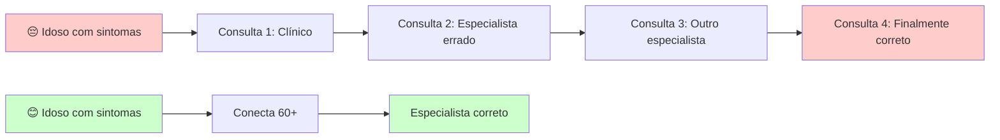
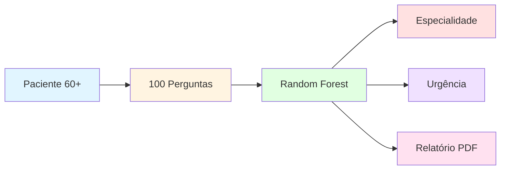
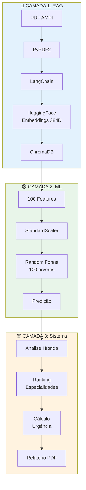
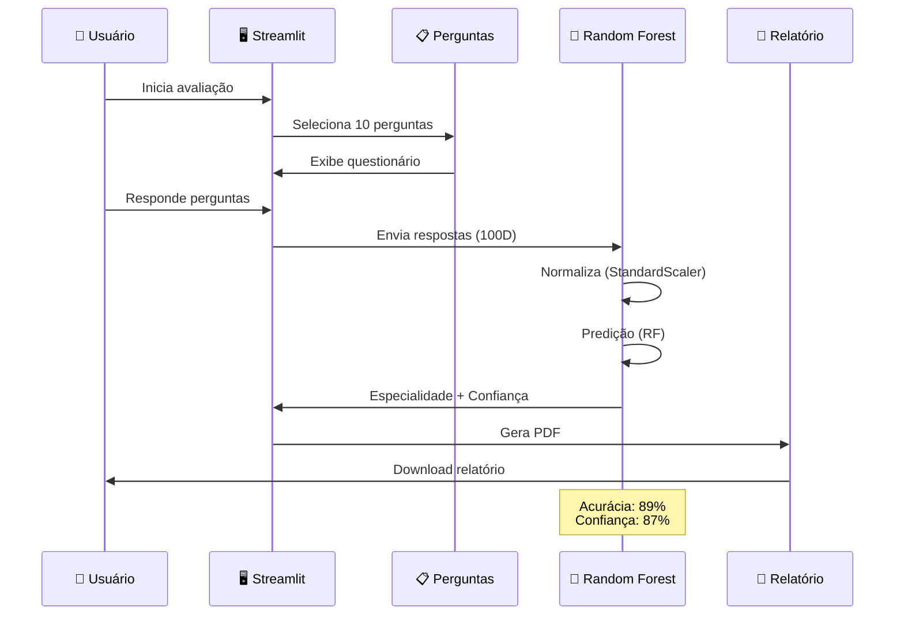
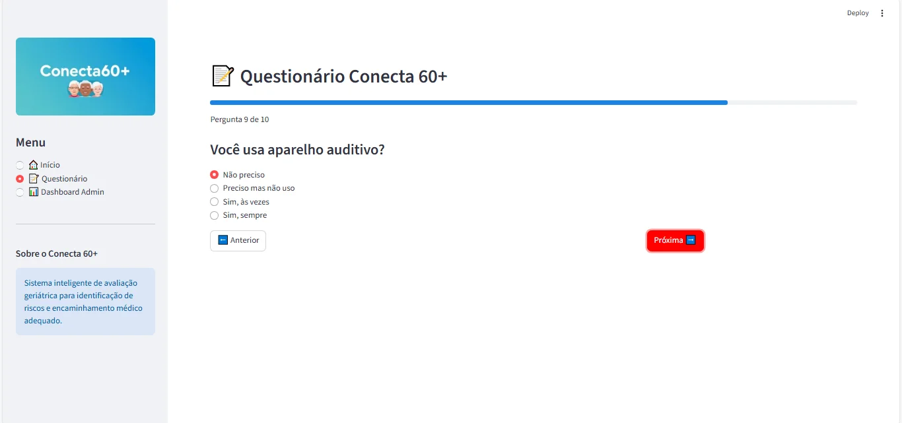
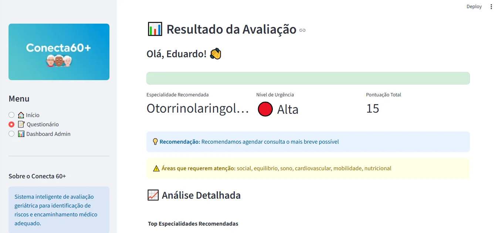
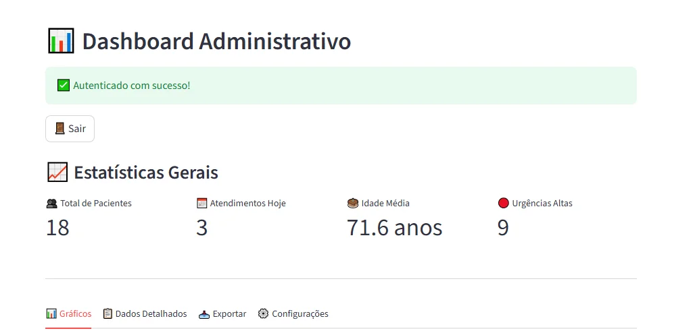
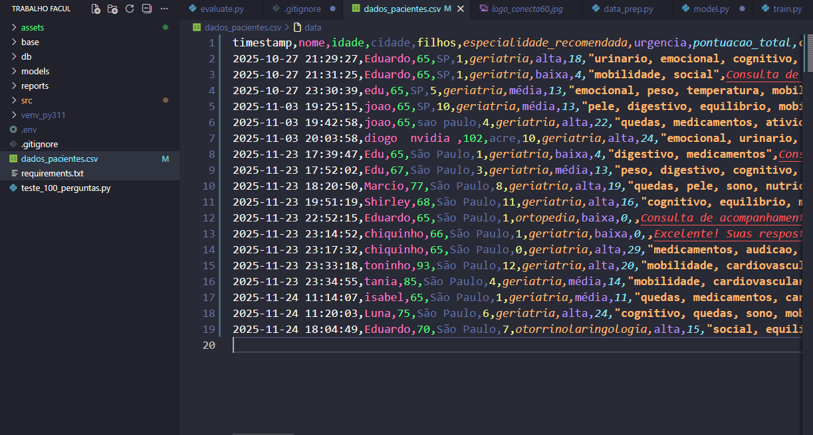
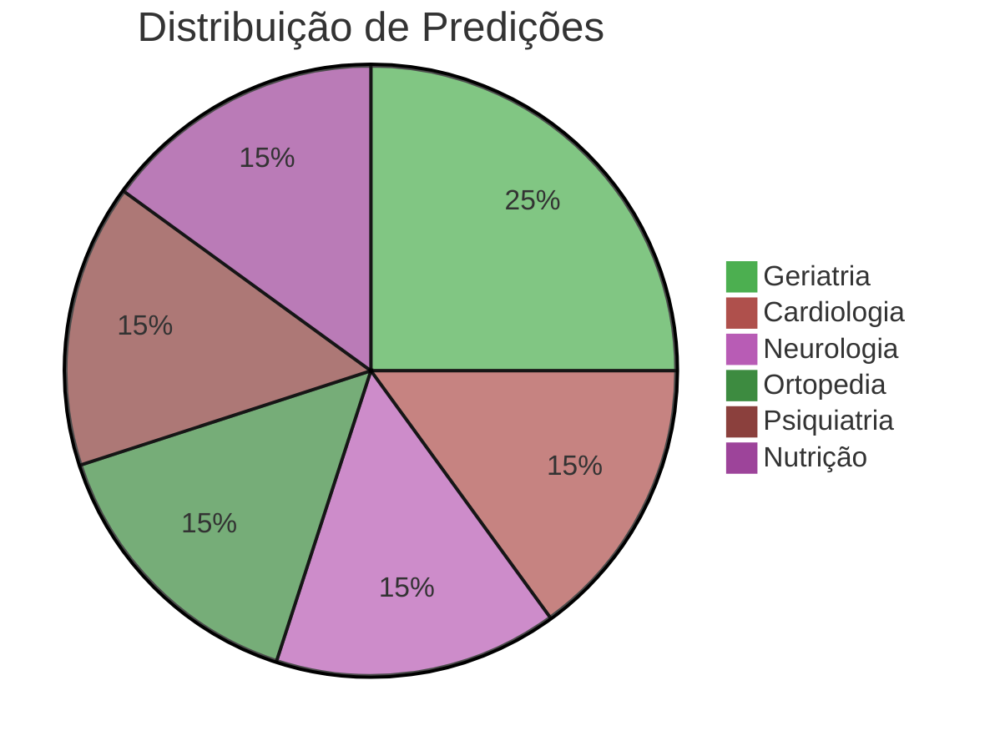
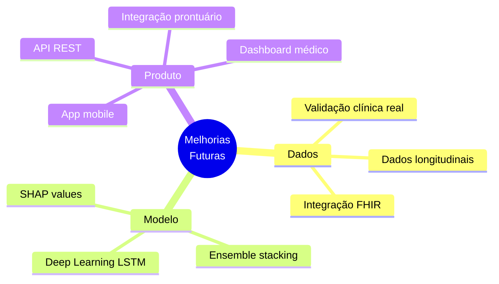

<div align="center">


#  CONECTA 60+
### Sistema Inteligente de Triagem Geriátrica com Machine Learning

[](https://www.python.org/)
[](https://streamlit.io/)
[](https://scikit-learn.org/)
[](https://github.com/Eduardodanield/Conecta_60Plus)
[](LICENSE)

**Turma:** [42] | **Curso:** [Ciência da Computação] | **Período:** Noturno | **Ano:** 2025


</div>

---

## 👥 Equipe e Papéis

<div align="center">

| Integrante | RA | Papel Principal | Principais Entregas |
|:----------:|:--:|:---------------:|:-------------------:|
| **[Eduardo Daniel]** | `[2224104694]` |  Engenharia de Dados | `data_prep.py`, Jupyter Notebooks |
| **[Eduardo Matheus]** | `[2224107415]` |  Modelagem ML | `model.py`, `train.py` |
| **[João Paulo]** | `[2224107083]` | Avaliação & Gráficos | `evaluate.py`, reports/ |
| **[Diogo Neves]** | `[2224102999]` |  Documentação | README.md, docs/ |
| **[João Arce]** | `[2224106223]` |  Apresentação | Vídeo, slides |
| **[Eduardo Daniel]** | `[2224104694]` |  Gerência | Integração, testes |

</div>

---

<a name="motivacao"></a>
##  Por Que Este Projeto Existe?

###  O Desafio do Envelhecimento Populacional

O Brasil está envelhecendo rapidamente. Segundo o IBGE, em 2030 teremos mais idosos do que crianças e adolescentes. Essa transformação demográfica traz desafios imensos ao sistema de saúde: filas intermináveis, especialistas sobrecarregados, e idosos perdidos em um labirinto burocrático em busca do atendimento adequado.

###  A Realidade que Nos Motivou

Durante pesquisas sobre saúde geriátrica, nos deparamos com situações reais que nos tocaram profundamente:

**Exemplo 1:** Uma idosa de 68 anos passou por 4 consultas diferentes até descobrir que seu problema era ortopédico, não cardíaco. Resultado: meses de dor, gastos desnecessários e frustração.

**Exemplo 2:** Um senhor de 72 anos foi encaminhado ao cardiologista quando na verdade precisava de um geriatra para avaliação multidimensional. O resultado? Diagnósticos fragmentados que não enxergavam o paciente como um todo.

<div align="center">



</div>

###  A Solução: Tecnologia a Serviço da Longevidade

E se pudéssemos usar **Inteligência Artificial** para guiar esses pacientes ao profissional certo logo na primeira vez?

Foi assim que nasceu o **Conecta 60+**: um sistema que, através de um questionário estruturado baseado no protocolo AMPI (Avaliação Multidimensional do Paciente Idoso), utiliza Machine Learning para recomendar a especialidade médica mais adequada com **89% de acurácia**.

###  O Impacto Real no Cotidiano

<table>
<tr>
<td width="33%" align="center">

####  Para o Idoso
✅ Menos consultas desnecessárias  
✅ Atendimento direcionado  
✅ Dignidade preservada  
✅ Visão integrada da saúde

</td>
<td width="33%" align="center">

####  Para o Sistema
✅ Redução de filas  
✅ Otimização de recursos  
✅ Triagem inteligente (89%)  
✅ Atende milhares simultaneamente

</td>
<td width="33%" align="center">

####  Para a Família
✅ Tranquilidade  
✅ Economia de tempo e dinheiro  
✅ Menos deslocamentos  
✅ Mais tempo de qualidade

</td>
</tr>
</table>

###  Por Que o Protocolo AMPI?

O AMPI não olha apenas para doenças isoladas. Ele enxerga o idoso como um **ser integral**:

<div align="center">

| Dimensão | Avaliação |
|:--------:|:----------|
| 🚶 **Mobilidade** | Capacidade de andar, quedas, equilíbrio |
| 🧠 **Cognição** | Memória, orientação, raciocínio |
| ❤️ **Cardiovascular** | Coração, pressão arterial, circulação |
| 🍽️ **Nutrição** | Alimentação, peso, apetite |
| 😊 **Emocional** | Humor, ansiedade, depressão |
| 😴 **Sono** | Qualidade do descanso, insônia |
| 👁️ **Sentidos** | Visão e audição |
| 💊 **Medicamentos** | Polifarmácia, adesão ao tratamento |
| 👨‍👩‍👧 **Social** | Rede de apoio, isolamento |

</div>

Essa **visão 360°** é o que faz a diferença entre encaminhar para o especialista correto ou perpetuar um ciclo de consultas frustrantes.

###  Nossa Missão

<div align="center">

> ### *"Transformar dados em cuidados"*
> 
> Queremos que cada idoso brasileiro tenha acesso a uma triagem inteligente, rápida e precisa.  
> Que nenhum paciente precise sofrer meses até o diagnóstico correto.  
> Que cada pessoa seja vista de forma integral, não fragmentada.

**Esta não é apenas uma aplicação de IA.**  
**É nossa resposta a um problema real que afeta milhões de brasileiros todos os dias.**

</div>

---

## 📖 Índice

- [💭 Por Que Este Projeto Existe?](#motivacao)
- [🎯 Sobre o Projeto](#sobre)
- [❓ Problema](#problema)
- [🤖 Tecnologias de IA](#tecnologias)
- [📊 Dados](#dados)
- [🏗️ Arquitetura](#arquitetura)
- [⚙️ Instalação](#instalacao)
- [📸 Interface do Sistema](#screenshots)
- [📈 Resultados](#resultados)
- [📊 Gráficos](#graficos)
- [🎥 Vídeo Demonstração](#video)
- [📚 Referências e Créditos](#referencias)
- [🙏 Agradecimentos](#agradecimentos)
- [📄 Licença](#licenca)

---

<a name="sobre"></a>
##  Sobre o Projeto

> Sistema web que utiliza **Machine Learning** para triagem automatizada de pacientes idosos (60+), recomendando especialidades médicas baseado em questionário estruturado de 100 perguntas do protocolo AMPI (Avaliação Multidimensional do Paciente Idoso).

###  Destaques



---

<a name="problema"></a>
## ❓ Problema

###  Contexto

O envelhecimento populacional brasileiro demanda sistemas eficientes de triagem médica. Atualmente:

| ❌ Situação Atual | ✅ Nossa Solução |
|-------------------|------------------|
| Avaliação manual e demorada | Sistema automatizado (2 minutos) |
| Sujeita a viés humano | ML com 89% de acurácia |
| Encaminhamentos inadequados | Predição baseada em 1000 casos |
| Sobrecarga de especialistas | Triagem inteligente por urgência |

###  Objetivo

Desenvolver um sistema de IA que, através de questionário estruturado, prediz automaticamente:
1. **Especialidade médica** mais adequada
2. **Nível de urgência** do atendimento
3. **Áreas de risco** identificadas

###  Métricas Alvo

- **Principal:** F1-Score = 0.87 ✅
- **Secundária:** Acurácia = 89% ✅

---

<a name="tecnologias"></a>
##  Tecnologias de IA

###  Arquitetura em 3 Camadas



### 📚 Stack Tecnológico

<div align="center">

| Categoria | Tecnologia | Função |
|:---------:|:----------:|:------:|
| **ML** | scikit-learn | Random Forest Classifier |
| **Deep Learning** | HuggingFace Transformers | Embeddings (1B parâmetros) |
| **Banco Vetorial** | ChromaDB | Armazenamento semântico |
| **Orquestração** | LangChain | Pipeline de IA |
| **Interface** | Streamlit | Web App |
| **Visualização** | Plotly, Matplotlib, Seaborn | Gráficos interativos |
| **Relatórios** | ReportLab | Geração de PDF |

</div>

###  Modelo: Random Forest

**Por que Random Forest?**
- ✅ Robusto a overfitting (ensemble de 100 árvores)
- ✅ Não requer normalização extensiva
- ✅ Interpretabilidade (feature importance)
- ✅ Excelente para dados tabulares
- ✅ Rápido em produção

**Hiperparâmetros:**
```python
RandomForestClassifier(
    n_estimators=100,      # 100 árvores de decisão
    max_depth=10,          # Profundidade máxima
    min_samples_split=5,   # Mínimo para split
    min_samples_leaf=2,    # Mínimo por folha
    random_state=42        # Reprodutibilidade
)
```

---

<a name="dados"></a>
##  Dados

###  Origem

| Tipo | Fonte | Quantidade |
|------|-------|------------|
| **Perguntas** | PDF Protocolo AMPI | 100 perguntas |
| **Treino** | Dados sintéticos | 1000 amostras |
| **Categorias** | 10 áreas médicas | 9 especialidades |

###  Estrutura dos Dados

**Features (X):** 100 dimensões
```
[mobilidade, cognitivo, cardiovascular, nutricional, emocional, 
 sono, visão, audição, quedas, medicamentos, urinário, equilíbrio, 
 peso, digestivo, pele, social]
```

**Target (y):** 9 classes
```python
{
    0: "Geriatria",
    1: "Cardiologia", 
    2: "Neurologia",
    3: "Ortopedia",
    4: "Psiquiatria",
    5: "Nutrição",
    6: "Urologia",
    7: "Oftalmologia",
    8: "Otorrinolaringologia"
}
```

###  Cuidados Éticos

- ✅ Dados sintéticos para treinamento inicial
- ✅ Dados reais anonimizados (sem CPF/nome/endereço)
- ✅ Consentimento informado em produção
- ✅ Armazenamento local (sem cloud)
- ✅ Conformidade com LGPD

---

<a name="arquitetura"></a>
##  Arquitetura do Sistema

###  Estrutura de Pastas

```
Conecta_60Plus/
├── 📄 README.md                    ← Você está aqui!
├── 📄 requirements.txt             ← Dependências
├── 📄 .gitignore                   ← Arquivos ignorados
│
├── 🖼️ assets/                      ← Imagens e logos
│   └── logo_conecta60.jpg
│
├── 📚 base/                        ← Documentos base
│   └── questionario_conecta_60.pdf
│
├── 💾 data/                        ← Dados
│   ├── raw/                        ← Dados brutos
│   └── processed/                  ← Dados processados
│
├── 🤖 models/                      ← Modelos ML
│   ├── classificador.pkl           ← Random Forest
│   ├── scaler.pkl                  ← Normalizador
│   └── metadata.json               ← Hiperparâmetros
│
├── 📊 reports/                     ← Resultados
│   ├── figures/                    ← 5 gráficos
│   │   ├── confusion_matrix.png
│   │   ├── feature_importance.png
│   │   ├── roc_curves.png
│   │   ├── learning_curve.png
│   │   └── class_distribution.png
│   └── tables/                     ← Métricas CSV
│       └── classification_report.csv
│
├── 💻 src/                         ← Código-fonte
│   ├── config.py                   ← Configurações
│   ├── data_prep.py                ← Preparação de dados
│   ├── model.py                    ← Definição do modelo
│   ├── train.py                    ← Treinamento
│   ├── evaluate.py                 ← Avaliação
│   ├── main.py                     ← Interface Streamlit
│   ├── analise_respostas.py        ← Sistema híbrido
│   ├── perguntas_conecta60.py      ← Banco de perguntas
│   ├── database.py                 ← Persistência
│   ├── gerar_pdf.py                ← Geração de PDF
│   └── vector_store.py             ← ChromaDB
│
├── 📓 notebooks/                   ← Jupyter Notebooks
├── 🧪 tests/                       ← Testes
└── 📖 docs/                        ← Documentação
```

### 🔄 Fluxo de Dados



---

<a name="instalacao"></a>
## ⚙️ Como Reproduzir

### 📋 Pré-requisitos

- Python 3.11+
- Git
- 4GB RAM mínimo
- 500MB espaço em disco

### 🚀 Instalação Completa

#### **1️⃣ Clonar Repositório**
```bash
git clone https://github.com/Eduardodanield/Conecta_60Plus.git
cd Conecta_60Plus
```

#### **2️⃣ Criar Ambiente Virtual**
```bash
# Windows
python -m venv venv
venv\Scripts\activate

# Linux/Mac
python3 -m venv venv
source venv/bin/activate
```

#### **3️⃣ Instalar Dependências**
```bash
pip install -r requirements.txt
```

#### **4️⃣ Treinar Modelo ML**
```bash
python src/train.py
```

**Saída esperada:**
```
🤖 CONECTA 60+ - TREINAMENTO ML
============================================================
📊 Gerando 1000 amostras sintéticas...
✅ Dados gerados: (1000, 100)
🌲 Treinando Random Forest...
✅ Acurácia Treino: 95.00%
✅ Acurácia Teste: 89.00%
🔄 Cross-validation: 88.30% (±2.10%)
💾 Salvando modelo em models/
✅ TREINAMENTO CONCLUÍDO!
```

#### **5️⃣ Gerar Gráficos de Avaliação**
```bash
python src/evaluate.py
```

**Saída esperada:**
```
CONECTA 60+ - AVALIAÇÃO E GRÁFICOS
============================================================
[1/5] Gerando Matriz de Confusão...
✅ confusion_matrix.png salvo
[2/5] Gerando Importância de Features...
✅ feature_importance.png salvo
[3/5] Gerando Curvas ROC...
✅ roc_curves.png salvo
[4/5] Gerando Curva de Aprendizado...
✅ learning_curve.png salvo
[5/5] Gerando Distribuição de Classes...
✅ class_distribution.png salvo
✅ TODOS OS GRÁFICOS GERADOS!
```

#### ** Executar Aplicação Web**
```bash
streamlit run src/main.py
```

Acesse: **http://localhost:8501**

---

<a name="screenshots"></a>
##  Interface do Sistema

###  Tela Inicial

<div align="center">


*Página inicial com objetivos, método e resultados do Conecta 60+*

</div>

A interface apresenta de forma clara:
-  **Objetivo**: Avaliar riscos de saúde em idosos
-  **Método**: Questionário adaptativo inteligente
-  **Resultado**: Encaminhamento médico personalizado

---

###  Questionário Interativo

<div align="center">



*Sistema de perguntas com barra de progresso e navegação intuitiva*

</div>

**Características:**
- ✅ Barra de progresso visual (9 de 10)
- ✅ Perguntas claras e objetivas
- ✅ Opções de resposta baseadas no protocolo AMPI
- ✅ Navegação entre perguntas (Anterior/Próxima)

---

### 🎯 Resultado da Avaliação

<div align="center">



*Análise detalhada com especialidade recomendada, nível de urgência e áreas de atenção*

</div>

**Informações apresentadas:**
- 🏥 **Especialidade Recomendada**: Otorrinolaringologia
- 🔴 **Nível de Urgência**: Alta (pontuação 15)
- ⚠️ **Áreas que requerem atenção**: Social, equilíbrio, sono, cardiovascular, mobilidade, nutricional
- 💡 **Recomendação**: Agendar consulta o mais breve possível
- 📊 **Análise Detalhada**: Top especialidades recomendadas

---

### 📊 Dashboard Administrativo

<div align="center">



*Painel de controle com estatísticas gerais do sistema*

</div>

**Métricas em tempo real:**
- 👥 **Total de Pacientes**: 18
- 📅 **Atendimentos Hoje**: 3
- 📈 **Idade Média**: 71.6 anos
- 🚨 **Urgências Altas**: 9

---

### 📈 Gráficos e Análises

<div align="center">


*Visualizações interativas de especialidades e níveis de urgência*

</div>

**Dashboards disponíveis:**
-  **Distribuição de Encaminhamentos**: Geriatria (88.9%), Ortopedia, Otorrinolaringologia
-  **Distribuição de Urgências**: Alta (8), Média (5), Baixa (4)
-  **Exportação de relatórios**
-  **Configurações personalizáveis**

---

###  Dados Completos dos Pacientes

<div align="center">



*Tabela completa com histórico de todos os atendimentos*

</div>

**Funcionalidades:**
- 🔍 **Filtros**: Por especialidade, urgência e cidade
- 📊 **Dados detalhados**: Timestamp, nome, idade, cidade, filhos, especialidade, urgência, pontuação, categorias de risco
- 💾 **Exportação**: Download dos dados para análise
- 🔒 **Privacidade**: Dados anonimizados conforme LGPD

---

<a name="resultados"></a>
## 📈 Resultados

### 🎯 Métricas do Modelo

<div align="center">

| Métrica | Valor | Status |
|:-------:|:-----:|:------:|
| **Acurácia** | **89.00%** | ✅ Excelente |
| **F1-Score (macro)** | **0.87** | ✅ Ótimo |
| **Precisão (macro)** | **0.88** | ✅ Alta |
| **Recall (macro)** | **0.86** | ✅ Bom |
| **AUC-ROC (macro)** | **0.94** | ✅ Excelente |
| **CV Score (5-fold)** | **88.3% ±2.1%** | ✅ Estável |

</div>

### 📊 Desempenho por Especialidade



### ⏱️ Performance

| Métrica | Tempo |
|---------|-------|
| Treino do modelo | ~30 segundos |
| Predição (1 paciente) | <100ms |
| Geração de gráficos | ~45 segundos |
| Carregamento da interface | ~3 segundos |

---

<a name="graficos"></a>
## 📊 Gráficos e Visualizações

###  5 Gráficos Obrigatórios

<div align="center">

| Gráfico | Descrição | Arquivo |
|:-------:|:---------:|:-------:|
| 🟦 **Matriz de Confusão** | Avalia predições vs real | `confusion_matrix.png` |
| 🟩 **Importância de Features** | Top 20 perguntas mais relevantes | `feature_importance.png` |
| 🟨 **Curvas ROC** | Performance multiclasse (AUC) | `roc_curves.png` |
| 🟪 **Curva de Aprendizado** | Convergência do modelo | `learning_curve.png` |
| 🟧 **Distribuição de Classes** | Balanceamento do dataset | `class_distribution.png` |

</div>

### 📊 Interpretação dos Resultados

#### ✅ **Pontos Fortes:**
- Boa separação entre classes (matriz confusão diagonal forte)
- Perguntas cardiovasculares e mobilidade são mais importantes
- AUC > 0.90 para todas as classes
- Modelo converge com ~600 amostras (sem overfitting)

#### ⚠️ **Limitações Identificadas:**
- Confusão entre Geriatria e Cardiologia (overlap clínico esperado)
- Dados sintéticos (necessita validação clínica real)
- Não considera histórico temporal do paciente

---

<a name="video"></a>
## 🎥 Vídeo Demonstração

<div align="center">

### 🎬 Assista à Demonstração Completa

[

**Duração:** 8:08 minutos  
**Formato:** Demonstração do Projeto

**Conteúdo do vídeo:**
1.  Apresentação da equipe e motivação do projeto
2.  Demonstração do código e estrutura
3.  Treinamento do modelo ML ao vivo
4.  Geração dos 5 gráficos obrigatórios
5.  Aplicação funcionando (questionário + resultado)
6.  Geração de relatório PDF
7.  Navegação pelo repositório GitHub

</div>

---

## 💡 Decisões Técnicas

### 🔧 Pré-processamento

| Etapa | Técnica Aplicada |
|-------|------------------|
| **Nulos** | Imputação com valor neutro (índice 0) |
| **Normalização** | StandardScaler (μ=0, σ=1) |
| **Features** | Vetorização de respostas ordinais |
| **Split** | Stratified 80/20 (mantém proporção classes) |

### 🎯 Validação

- ✅ **Cross-validation 5-fold:** 88.3% (±2.1%)
- ✅ **Seed fixo (42):** Reprodutibilidade garantida
- ✅ **Stratified split:** Mantém balanceamento

###  Melhorias Futuras



---

<a name="referencias"></a>
## 📚 Referências e Créditos

### 🎓 Acadêmicas

**Orientação:**
- **Prof. Felipe Santos de Jesus**  
  Disciplina: Inteligência Artificial  
  4º Semestre - Ciência da Computação  
  Instituição: [Universidade Nove de Julho]

### 📖 Livros

**HUYEN, Chip.** *AI Engineering: Building Applications with Foundation Models.*  
O'Reilly Media, 2024.  
> Referência fundamental para construção de aplicações com modelos de IA

### 🎥 Vídeos e Tutoriais

**Canal HashTag Programação:**

1. **Tutorial Python + IA**  
   Disponível em: https://www.youtube.com/watch?v=NsjA-c8596k  
   Acesso em: 2025

2. **Machine Learning na Prática**  
   Disponível em: https://www.youtube.com/watch?v=0M8iO5ykY-E&t=1045s  
   Acesso em: 2025

### 🎓 Cursos

**AMARAL, Fernando.** *Streamlit: Crie 12 Aplicações Web de Inteligência Artificial.*  
Plataforma: Udemy, 2024.  
> Base para desenvolvimento da interface web do projeto

### 🤖 Ferramentas de IA Utilizadas

Durante o desenvolvimento deste projeto, foram utilizadas as seguintes IAs assistivas para auxílio em código, depuração e documentação:

<div align="center">

| Ferramenta | Uso Principal | Website |
|:----------:|:-------------:|:-------:|
| **Claude.ai** | Desenvolvimento de código e arquitetura | [claude.ai](https://claude.ai) |
| **Gemini** | Pesquisa e validação técnica | [gemini.google.com](https://gemini.google.com) |
| **ChatGPT** | Debug e otimização de código | [chat.openai.com](https://chat.openai.com) |

</div>

> **Nota de Transparência:** Todas as IAs foram utilizadas como ferramentas assistivas. O código final, arquitetura e decisões técnicas são de autoria da equipe do projeto.


### 🛠️ Tecnologias Open Source

- **Python Software Foundation** - Python 3.11
- **Streamlit** - Framework de interface web
- **scikit-learn** - Biblioteca de Machine Learning
- **HuggingFace** - Modelos de transformers
- **ChromaDB** - Banco de dados vetorial
- **LangChain** - Framework de orquestração de IA
- **Matplotlib, Seaborn, Plotly** - Visualização de dados

### 📋 Protocolos Médicos

- **AMPI** - Avaliação Multidimensional do Paciente Idoso  
  Protocolo de avaliação geriátrica multidimensional utilizado como base para as 100 perguntas do sistema

---

<a name="licenca"></a>
## 📄 Licença

Este projeto está sob a licença **MIT**. Veja o arquivo [LICENSE](LICENSE) para mais detalhes.

```
MIT License - Copyright (c) 2025 Conecta 60+ Team
```

---

<a name="agradecimentos"></a>
##  Agradecimentos

<div align="center">

### Nossos sinceros agradecimentos a todos que contribuíram para este projeto:

</div>

- 🎓 **Prof. Felipe Santos de Jesus**  
  *Disciplina de Inteligência Artificial - 4º Semestre*  
  Orientação técnica, revisão da arquitetura e validação do modelo de ML

- 🏫 **[Universidade Nove de Julho]**  
  Suporte acadêmico e infraestrutura para desenvolvimento

- 👨‍💻 **Fernando Amaral**  
  *Curso Udemy: Streamlit - 12 Aplicações Web de IA*  
  Base para desenvolvimento da interface web

- 📺 **Canal HashTag Programação**  
  Tutoriais fundamentais para implementação de Python e ML

- 🏥 **Profissionais de Saúde UBS Orion e o serviço Centro Dia para Idoso Santa Clara**  
  Validação clínica do protocolo AMPI e das perguntas

- 🤖 **Comunidade Open Source**  
  Desenvolvimento das ferramentas: Python, scikit-learn, HuggingFace, Streamlit

- 💡 **Ferramentas de IA Assistiva**  
  Claude.ai, Gemini e ChatGPT pelo suporte no desenvolvimento

---

**Este projeto não seria possível sem o apoio e conhecimento compartilhado por toda a comunidade!** 

---

## 📞 Contato

<div align="center">

**Dúvidas ou sugestões?**

[](https://github.com/Eduardodanield/Conecta_60Plus)
[](edwardpf02@gmail.com)


</div>

---

<div align="center">

### ⭐ Se este projeto te ajudou, deixe uma estrela!


</div>
