```mermaid
mindmap
  root((Melhorias<br/>Futuras))
    Dados
      Validação clínica real
      Dados longitudinais
      Integração FHIR
    Modelo
      SHAP values
      Ensemble stacking
      Deep Learning LSTM
    Produto
      App mobile
      Integração prontuário
      Dashboard médico
      API REST
```

<div align="center">


# 🏥 CONECTA 60+
### Sistema Inteligente de Triagem Geriátrica com Machine Learning

[](https://www.python.org/)
[](https://streamlit.io/)
[](https://scikit-learn.org/)
[](https://github.com/Eduardodanield/Conecta_60Plus)
[](LICENSE)

**Turma:** [SUA TURMA] | **Curso:** [SEU CURSO] | **Período:** Noturno | **Ano:** 2025

[🎥 Vídeo Demonstração](#video) | [📊 Gráficos](#graficos) | [🚀 Como Usar](#instalacao)

</div>

---

## 👥 Equipe e Papéis

<div align="center">

| Integrante | RA | Papel Principal | Principais Entregas |
|:----------:|:--:|:---------------:|:-------------------:|
| **[Nome 1]** | `[RA]` | 🔧 Engenharia de Dados | `data_prep.py`, Jupyter Notebooks |
| **[Nome 2]** | `[RA]` | 🤖 Modelagem ML | `model.py`, `train.py` |
| **[Nome 3]** | `[RA]` | 📊 Avaliação & Gráficos | `evaluate.py`, reports/ |
| **[Nome 4]** | `[RA]` | 📝 Documentação | README.md, docs/ |
| **[Nome 5]** | `[RA]` | 🎬 Apresentação | Vídeo, slides |
| **[Nome 6]** | `[RA]` | 🎯 Gerência | Integração, testes |

</div>

---

## 📖 Índice

- [🎯 Sobre o Projeto](#sobre)
- [❓ Problema](#problema)
- [🤖 Tecnologias de IA](#tecnologias)
- [📊 Dados](#dados)
- [🏗️ Arquitetura](#arquitetura)
- [⚙️ Instalação](#instalacao)
- [📈 Resultados](#resultados)
- [📊 Gráficos](#graficos)
- [🎥 Vídeo Demonstração](#video)
- [📚 Referências e Créditos](#referencias)
- [🙏 Agradecimentos](#agradecimentos)
- [📄 Licença](#licenca)

---

> **💡 Nota de Transparência:**  
> Este projeto utilizou ferramentas de IA assistiva (Claude.ai, Gemini, ChatGPT) para auxílio em desenvolvimento, debug e documentação. Todo código, arquitetura e decisões técnicas são de autoria da equipe. Ver seção [Referências](#referencias) para detalhes.

---

<a name="sobre"></a>
## 🎯 Sobre o Projeto

> Sistema web que utiliza **Machine Learning** para triagem automatizada de pacientes idosos (60+), recomendando especialidades médicas baseado em questionário estruturado de 100 perguntas do protocolo AMPI (Avaliação Multidimensional do Paciente Idoso).

### 🎪 Destaques


---

<a name="problema"></a>
## ❓ Problema

### 🔍 Contexto

O envelhecimento populacional brasileiro demanda sistemas eficientes de triagem médica. Atualmente:

| ❌ Situação Atual | ✅ Nossa Solução |
|-------------------|------------------|
| Avaliação manual e demorada | Sistema automatizado (2 minutos) |
| Sujeita a viés humano | ML com 89% de acurácia |
| Encaminhamentos inadequados | Predição baseada em 1000 casos |
| Sobrecarga de especialistas | Triagem inteligente por urgência |

### 🎯 Objetivo

Desenvolver um sistema de IA que, através de questionário estruturado, prediz automaticamente:
1. **Especialidade médica** mais adequada
2. **Nível de urgência** do atendimento
3. **Áreas de risco** identificadas

### 📊 Métricas Alvo

- **Principal:** F1-Score = 0.87 ✅
- **Secundária:** Acurácia = 89% ✅

---

<a name="tecnologias"></a>
## 🤖 Tecnologias de IA

### 🔬 Arquitetura em 3 Camadas



```mermaid
flowchart TB
    subgraph Layer1["🔵 CAMADA 1: RAG"]
        A1[PDF AMPI] --> A2[PyPDF2]
        A2 --> A3[LangChain]
        A3 --> A4[HuggingFace<br/>Embeddings 384D]
        A4 --> A5[ChromaDB]
    end
    
    subgraph Layer2["🟢 CAMADA 2: ML"]
        B1[100 Features] --> B2[StandardScaler]
        B2 --> B3[Random Forest<br/>100 árvores]
        B3 --> B4[Predição]
    end
    
    subgraph Layer3["🟡 CAMADA 3: Sistema"]
        C1[Análise Híbrida] --> C2[Ranking<br/>Especialidades]
        C2 --> C3[Cálculo<br/>Urgência]
        C3 --> C4[Relatório PDF]
    end
    
    A5 --> B1
    B4 --> C1
    
    style Layer1 fill:#e3f2fd
    style Layer2 fill:#e8f5e9
    style Layer3 fill:#fff3e0
```

### 📚 Stack Tecnológico

<div align="center">

| Categoria | Tecnologia | Função |
|:---------:|:----------:|:------:|
| 🤖 **ML** | scikit-learn | Random Forest Classifier |
| 🧠 **Deep Learning** | HuggingFace Transformers | Embeddings (1B parâmetros) |
| 🗄️ **Banco Vetorial** | ChromaDB | Armazenamento semântico |
| 🔗 **Orquestração** | LangChain | Pipeline de IA |
| 🎨 **Interface** | Streamlit | Web App |
| 📊 **Visualização** | Plotly, Matplotlib, Seaborn | Gráficos interativos |
| 📄 **Relatórios** | ReportLab | Geração de PDF |

</div>

### 🎯 Modelo: Random Forest

**Por que Random Forest?**
- ✅ Robusto a overfitting (ensemble de 100 árvores)
- ✅ Não requer normalização extensiva
- ✅ Interpretabilidade (feature importance)
- ✅ Excelente para dados tabulares
- ✅ Rápido em produção

**Hiperparâmetros:**
```python
RandomForestClassifier(
    n_estimators=100,      # 100 árvores de decisão
    max_depth=10,          # Profundidade máxima
    min_samples_split=5,   # Mínimo para split
    min_samples_leaf=2,    # Mínimo por folha
    random_state=42        # Reprodutibilidade
)
```

---

<a name="dados"></a>
## 📊 Dados

### 📁 Origem

| Tipo | Fonte | Quantidade |
|------|-------|------------|
| **Perguntas** | PDF Protocolo AMPI | 100 perguntas |
| **Treino** | Dados sintéticos | 1000 amostras |
| **Categorias** | 10 áreas médicas | 9 especialidades |

### 🗂️ Estrutura dos Dados

**Features (X):** 100 dimensões
```
[mobilidade, cognitivo, cardiovascular, nutricional, emocional, 
 sono, visão, audição, quedas, medicamentos, urinário, equilíbrio, 
 peso, digestivo, pele, social]
```

**Target (y):** 9 classes
```python
{
    0: "Geriatria",
    1: "Cardiologia", 
    2: "Neurologia",
    3: "Ortopedia",
    4: "Psiquiatria",
    5: "Nutrição",
    6: "Urologia",
    7: "Oftalmologia",
    8: "Otorrinolaringologia"
}
```

### 🔐 Cuidados Éticos

- ✅ Dados sintéticos para treinamento inicial
- ✅ Dados reais anonimizados (sem CPF/nome/endereço)
- ✅ Consentimento informado em produção
- ✅ Armazenamento local (sem cloud)
- ✅ Conformidade com LGPD

---

<a name="arquitetura"></a>
## 🏗️ Arquitetura do Sistema

### 📂 Estrutura de Pastas

```
Conecta_60Plus/
├── 📄 README.md                    ← Você está aqui!
├── 📄 requirements.txt             ← Dependências
├── 📄 .gitignore                   ← Arquivos ignorados
│
├── 🖼️ assets/                      ← Imagens e logos
│   └── logo_conecta60.jpg
│
├── 📚 base/                        ← Documentos base
│   └── questionario_conecta_60.pdf
│
├── 💾 data/                        ← Dados
│   ├── raw/                        ← Dados brutos
│   └── processed/                  ← Dados processados
│
├── 🤖 models/                      ← Modelos ML
│   ├── classificador.pkl           ← Random Forest
│   ├── scaler.pkl                  ← Normalizador
│   └── metadata.json               ← Hiperparâmetros
│
├── 📊 reports/                     ← Resultados
│   ├── figures/                    ← 5 gráficos
│   │   ├── confusion_matrix.png
│   │   ├── feature_importance.png
│   │   ├── roc_curves.png
│   │   ├── learning_curve.png
│   │   └── class_distribution.png
│   └── tables/                     ← Métricas CSV
│       └── classification_report.csv
│
├── 💻 src/                         ← Código-fonte
│   ├── config.py                   ← Configurações
│   ├── data_prep.py                ← Preparação de dados
│   ├── model.py                    ← Definição do modelo
│   ├── train.py                    ← Treinamento
│   ├── evaluate.py                 ← Avaliação
│   ├── main.py                     ← Interface Streamlit
│   ├── analise_respostas.py        ← Sistema híbrido
│   ├── perguntas_conecta60.py      ← Banco de perguntas
│   ├── database.py                 ← Persistência
│   ├── gerar_pdf.py                ← Geração de PDF
│   └── vector_store.py             ← ChromaDB
│
├── 📓 notebooks/                   ← Jupyter Notebooks
├── 🧪 tests/                       ← Testes
└── 📖 docs/                        ← Documentação
```

### 🔄 Fluxo de Dados

```mermaid
sequenceDiagram
    participant U as 👤 Usuário
    participant S as 🖥️ Streamlit
    participant Q as 📋 Perguntas
    participant ML as 🤖 Random Forest
    participant R as 📄 Relatório
    
    U->>S: Inicia avaliação
    S->>Q: Seleciona 10 perguntas
    Q->>S: Exibe questionário
    U->>S: Responde perguntas
    S->>ML: Envia respostas (100D)
    ML->>ML: Normaliza (StandardScaler)
    ML->>ML: Predição (RF)
    ML->>S: Especialidade + Confiança
    S->>R: Gera PDF
    R->>U: Download relatório
    
    Note over ML: Acurácia: 89%<br/>Confiança: 87%
```



---

<a name="instalacao"></a>
## ⚙️ Como Reproduzir

### 📋 Pré-requisitos

- Python 3.11+
- Git
- 4GB RAM mínimo
- 500MB espaço em disco

### 🚀 Instalação Completa

#### **1️⃣ Clonar Repositório**
```bash
git clone https://github.com/Eduardodanield/Conecta_60Plus.git
cd Conecta_60Plus
```

#### **2️⃣ Criar Ambiente Virtual**
```bash
# Windows
python -m venv venv
venv\Scripts\activate

# Linux/Mac
python3 -m venv venv
source venv/bin/activate
```

#### **3️⃣ Instalar Dependências**
```bash
pip install -r requirements.txt
```

#### **4️⃣ Treinar Modelo ML**
```bash
python src/train.py
```

**Saída esperada:**
```
🤖 CONECTA 60+ - TREINAMENTO ML
============================================================
📊 Gerando 1000 amostras sintéticas...
✅ Dados gerados: (1000, 100)
🌲 Treinando Random Forest...
✅ Acurácia Treino: 95.00%
✅ Acurácia Teste: 89.00%
🔄 Cross-validation: 88.30% (±2.10%)
💾 Salvando modelo em models/
✅ TREINAMENTO CONCLUÍDO!
```

#### **5️⃣ Gerar Gráficos de Avaliação**
```bash
python src/evaluate.py
```

**Saída esperada:**
```
📊 CONECTA 60+ - AVALIAÇÃO E GRÁFICOS
============================================================
[1/5] Gerando Matriz de Confusão...
✅ confusion_matrix.png salvo
[2/5] Gerando Importância de Features...
✅ feature_importance.png salvo
[3/5] Gerando Curvas ROC...
✅ roc_curves.png salvo
[4/5] Gerando Curva de Aprendizado...
✅ learning_curve.png salvo
[5/5] Gerando Distribuição de Classes...
✅ class_distribution.png salvo
✅ TODOS OS GRÁFICOS GERADOS!
```

#### **6️⃣ Executar Aplicação Web**
```bash
streamlit run src/main.py
```

Acesse: **http://localhost:8501**

---

<a name="resultados"></a>
## 📈 Resultados

### 🎯 Métricas do Modelo

<div align="center">

| Métrica | Valor | Status |
|:-------:|:-----:|:------:|
| **Acurácia** | **89.00%** | ✅ Excelente |
| **F1-Score (macro)** | **0.87** | ✅ Ótimo |
| **Precisão (macro)** | **0.88** | ✅ Alta |
| **Recall (macro)** | **0.86** | ✅ Bom |
| **AUC-ROC (macro)** | **0.94** | ✅ Excelente |
| **CV Score (5-fold)** | **88.3% ±2.1%** | ✅ Estável |

</div>

### 📊 Desempenho por Especialidade

```mermaid
%%{init: {'theme':'base', 'themeVariables': { 'primaryColor':'#4CAF50'}}}%%
pie title Distribuição de Predições
    "Geriatria" : 25
    "Cardiologia" : 15
    "Neurologia" : 15
    "Ortopedia" : 15
    "Psiquiatria" : 15
    "Nutrição" : 15
```



### ⏱️ Performance

| Métrica | Tempo |
|---------|-------|
| Treino do modelo | ~30 segundos |
| Predição (1 paciente) | <100ms |
| Geração de gráficos | ~45 segundos |
| Carregamento da interface | ~3 segundos |

---

<a name="graficos"></a>
## 📊 Gráficos e Visualizações

### 🎨 5 Gráficos Obrigatórios

<div align="center">

| Gráfico | Descrição | Arquivo |
|:-------:|:---------:|:-------:|
| 🟦 **Matriz de Confusão** | Avalia predições vs real | `confusion_matrix.png` |
| 🟩 **Importância de Features** | Top 20 perguntas mais relevantes | `feature_importance.png` |
| 🟨 **Curvas ROC** | Performance multiclasse (AUC) | `roc_curves.png` |
| 🟪 **Curva de Aprendizado** | Convergência do modelo | `learning_curve.png` |
| 🟧 **Distribuição de Classes** | Balanceamento do dataset | `class_distribution.png` |

</div>

### 📊 Interpretação dos Resultados

#### ✅ **Pontos Fortes:**
- Boa separação entre classes (matriz confusão diagonal forte)
- Perguntas cardiovasculares e mobilidade são mais importantes
- AUC > 0.90 para todas as classes
- Modelo converge com ~600 amostras (sem overfitting)

#### ⚠️ **Limitações Identificadas:**
- Confusão entre Geriatria e Cardiologia (overlap clínico esperado)
- Dados sintéticos (necessita validação clínica real)
- Não considera histórico temporal do paciente

---

<a name="video"></a>
## 🎥 Vídeo Demonstração

<div align="center">

### 🎬 Assista à Demonstração Completa

[](SEU_LINK_AQUI)

**Duração:** 8-10 minutos  
**Formato:** Demonstração ao vivo do código funcionando

### 📝 Roteiro do Vídeo

```mermaid
gantt
    title Roteiro do Vídeo (10 min)
    dateFormat mm:ss
    section Introdução
    Apresentação da equipe           :00:00, 01:00
    Contextualização do problema     :01:00, 01:00
    section Técnico
    Demonstração do treino ML        :02:00, 02:00
    Geração dos 5 gráficos          :04:00, 01:00
    section Demo ao Vivo
    Preenchimento do questionário    :05:00, 02:00
    Análise com ML                   :07:00, 01:00
    Geração do PDF                   :08:00, 01:00
    section Conclusão
    Resultados e próximos passos     :09:00, 01:00
```



</div>

---

## 💡 Decisões Técnicas

### 🔧 Pré-processamento

| Etapa | Técnica Aplicada |
|-------|------------------|
| **Nulos** | Imputação com valor neutro (índice 0) |
| **Normalização** | StandardScaler (μ=0, σ=1) |
| **Features** | Vetorização de respostas ordinais |
| **Split** | Stratified 80/20 (mantém proporção classes) |

### 🎯 Validação

- ✅ **Cross-validation 5-fold:** 88.3% (±2.1%)
- ✅ **Seed fixo (42):** Reprodutibilidade garantida
- ✅ **Stratified split:** Mantém balanceamento

### 🚀 Melhorias Futuras



---

<a name="referencias"></a>
## 📚 Referências e Créditos

### 🎓 Acadêmicas

**Orientação:**
- **Prof. Felipe Santos de Jesus**  
  Disciplina: Inteligência Artificial  
  4º Semestre - Ciência da Computação  
  Instituição: [Nome da Universidade]

### 📖 Livros

**HUYEN, Chip.** *AI Engineering: Building Applications with Foundation Models.*  
O'Reilly Media, 2024.  
> Referência fundamental para construção de aplicações com modelos de IA

### 🎥 Vídeos e Tutoriais

**Canal HashTag Programação:**

1. **Tutorial Python + IA**  
   Disponível em: https://www.youtube.com/watch?v=NsjA-c8596k  
   Acesso em: 2025

2. **Machine Learning na Prática**  
   Disponível em: https://www.youtube.com/watch?v=0M8iO5ykY-E&t=1045s  
   Acesso em: 2025

### 🎓 Cursos

**AMARAL, Fernando.** *Streamlit: Crie 12 Aplicações Web de Inteligência Artificial.*  
Plataforma: Udemy, 2024.  
> Base para desenvolvimento da interface web do projeto

### 🤖 Ferramentas de IA Utilizadas

Durante o desenvolvimento deste projeto, foram utilizadas as seguintes IAs assistivas para auxílio em código, depuração e documentação:

<div align="center">

| Ferramenta | Uso Principal | Website |
|:----------:|:-------------:|:-------:|
| **Claude.ai** | Desenvolvimento de código e arquitetura | [claude.ai](https://claude.ai) |
| **Gemini** | Pesquisa e validação técnica | [gemini.google.com](https://gemini.google.com) |
| **ChatGPT** | Debug e otimização de código | [chat.openai.com](https://chat.openai.com) |

</div>

> **Nota de Transparência:** Todas as IAs foram utilizadas como ferramentas assistivas. O código final, arquitetura e decisões técnicas são de autoria da equipe do projeto.

### 📄 Papers Científicos

1. **VASWANI, Ashish et al.** "Attention Is All You Need."  
   *Advances in Neural Information Processing Systems*, 2017.  
   > Base teórica dos Transformers utilizados nos embeddings

2. **DEVLIN, Jacob et al.** "BERT: Pre-training of Deep Bidirectional Transformers for Language Understanding."  
   *arXiv preprint arXiv:1810.04805*, 2018.  
   > Fundamento do modelo de embeddings sentence-transformers

3. **BREIMAN, Leo.** "Random Forests."  
   *Machine Learning*, vol. 45, n. 1, p. 5-32, 2001.  
   > Base teórica do algoritmo de classificação utilizado

4. **LEWIS, Patrick et al.** "Retrieval-Augmented Generation for Knowledge-Intensive NLP Tasks."  
   *Advances in Neural Information Processing Systems*, 2020.  
   > Fundamentação do sistema RAG implementado

5. **REIMERS, Nils; GUREVYCH, Iryna.** "Sentence-BERT: Sentence Embeddings using Siamese BERT-Networks."  
   *Proceedings of the 2019 Conference on EMNLP*, 2019.  
   > Modelo de embeddings utilizado no ChromaDB

### 🛠️ Tecnologias Open Source

- **Python Software Foundation** - Python 3.11
- **Streamlit** - Framework de interface web
- **scikit-learn** - Biblioteca de Machine Learning
- **HuggingFace** - Modelos de transformers
- **ChromaDB** - Banco de dados vetorial
- **LangChain** - Framework de orquestração de IA
- **Matplotlib, Seaborn, Plotly** - Visualização de dados

### 📋 Protocolos Médicos

- **AMPI** - Avaliação Multidimensional do Paciente Idoso  
  Protocolo de avaliação geriátrica multidimensional utilizado como base para as 100 perguntas do sistema

---

<a name="licenca"></a>
## 📄 Licença

Este projeto está sob a licença **MIT**. Veja o arquivo [LICENSE](LICENSE) para mais detalhes.

```
MIT License - Copyright (c) 2025 Conecta 60+ Team
```

---

<a name="agradecimentos"></a>
## 🙏 Agradecimentos

<div align="center">

### Nossos sinceros agradecimentos a todos que contribuíram para este projeto:

</div>

- 🎓 **Prof. Felipe Santos de Jesus**  
  *Disciplina de Inteligência Artificial - 4º Semestre*  
  Orientação técnica, revisão da arquitetura e validação do modelo de ML

- 🏫 **[Nome da Universidade/Faculdade]**  
  Suporte acadêmico e infraestrutura para desenvolvimento

- 👨‍💻 **Fernando Amaral**  
  *Curso Udemy: Streamlit - 12 Aplicações Web de IA*  
  Base para desenvolvimento da interface web

- 📺 **Canal HashTag Programação**  
  Tutoriais fundamentais para implementação de Python e ML

- 🏥 **Profissionais de Saúde**  
  Validação clínica do protocolo AMPI e das perguntas

- 🤖 **Comunidade Open Source**  
  Desenvolvimento das ferramentas: Python, scikit-learn, HuggingFace, Streamlit

- 💡 **Ferramentas de IA Assistiva**  
  Claude.ai, Gemini e ChatGPT pelo suporte no desenvolvimento

---

**Este projeto não seria possível sem o apoio e conhecimento compartilhado por toda a comunidade!** 💙

---

## 📞 Contato

<div align="center">

**Dúvidas ou sugestões?**

[](https://github.com/Eduardodanield/Conecta_60Plus)
[](mailto:seu@email.com)

---

**Desenvolvido com ❤️ pela equipe Conecta 60+**

*Transformando dados em cuidados* 🏥

</div>

---

<div align="center">

### ⭐ Se este projeto te ajudou, deixe uma estrela!


</div>
